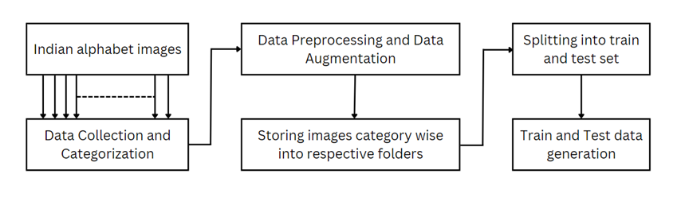
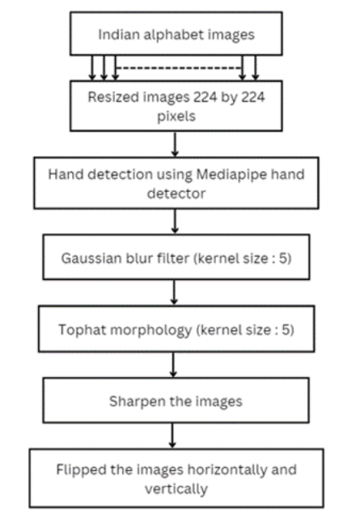
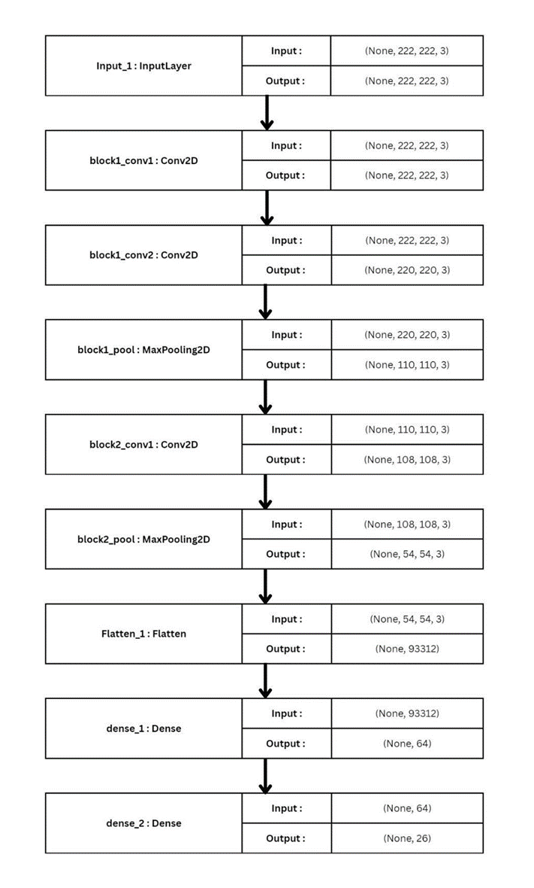
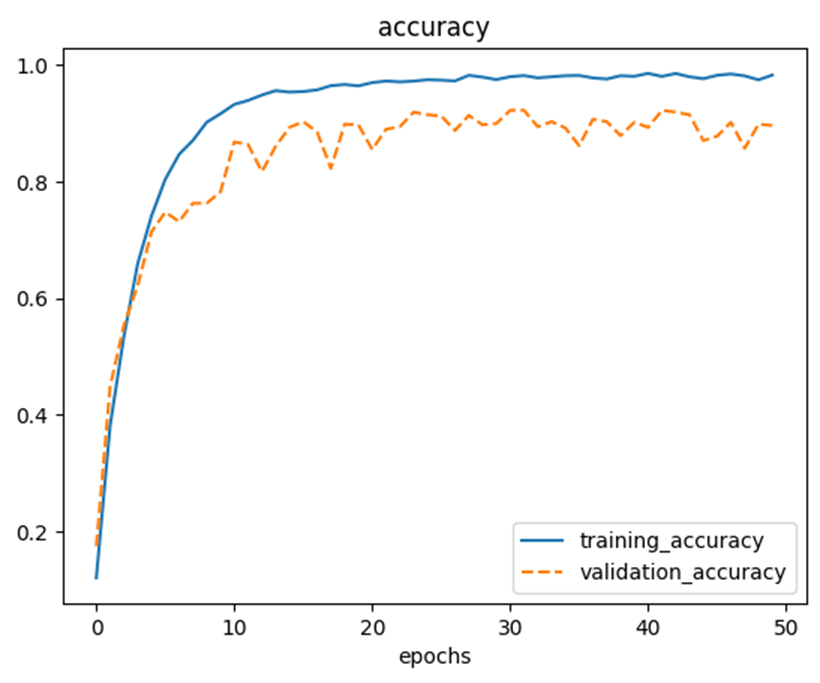
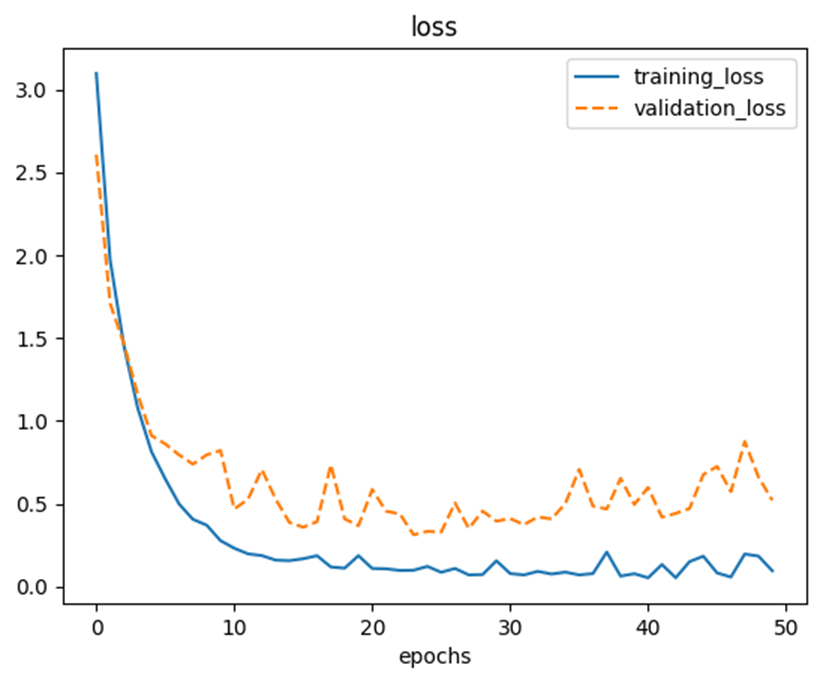
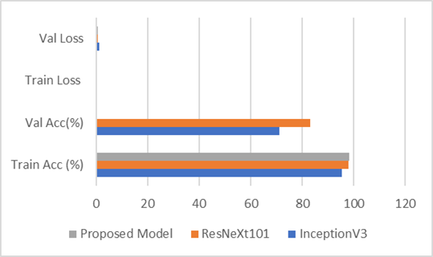

# A Media-pipe integrated deep learning model for ISL (Alphabet) recognition and converting Text to Sound with Video Input

## Table of Contents

- [Introduction](#introduction)
- [Project Workflow](#project-workflow)
- [Proposed Solution](#proposed-solution)
- [Data Acquisition](#data-acquisition)
- [Data Preprocessing](#data-preprocessing)
- [Model Architecture - CNN Model Generation](#model-architecture---cnn-model-generation)
- [Training \& Testing of the Model](#training--testing-of-the-model)
- [Text to Speech conversion](#text-to-speech-conversion)
- [Results \& Comparison](#results--comparison)
- [Credits](#credits)

### Datasets

[Preprocessed Data](https://drive.google.com/drive/folders/1CPb95ll-2v6IYHTGMFAZXaKnJnf5SPSm?usp=sharing)  
[Without Preprocessing Data](https://drive.google.com/drive/folders/1YF9w3k9knvrYDhrbj92RNpXfsvH30LUJ?usp=sharing)

## Introduction

- Sign language is used as a primary mode of communication by Individuals with auditory impairments. It enables, as well as facilitates effective communication between hearing-impaired individuals and those who are not. It can also be used by individuals who are not hearing impaired but have communication difficulties due to speech impairments or developmental disorders. The Sign languages used around the world are of many regional types, such as American Sign Language, Auslan (Australian Sign Language), and British Sign Language,
among others. In India, ISL or Indian sign language is used throughout the country as a medium of instruction in educational facilities. In sign language, information transfer is facilitated through a combination of hand gestures, facial expressions, and body language. Words or concepts are represented by combining the different hand and finger movements, handshapes, and hand positions. The use of facial gestures and body language also plays a major part in conveying meaning, as they add nuance, emotions, and tone to the signs. Additionally, information can be conveyed through the speed, rhythm, and movement of signs as well.

- Indian Sign Language or ISL can be separated from the other notable sign languages through factors like Vocabulary, Grammar etc. While there exist regional variations in Indian Sign Language, influenced by the spoken languages in India, the alphabet base used in teaching remains largely unchanged. It was estimated that in 2011, around 5 million people in India who identified as deaf or hard of hearing. ISL contains two types of signs, namely, static and dynamic signs. Concepts or words which can be expressed with a static position that does not involve any changes in handshape or movement are referred to as Static signs. On the other hand, Dynamic Signs involve movement or changes in handshape to represent the words or concepts. They may involve compound movements of hands, arms, or body along with the movement of fingers. These gestures are auto-captured with the help of advanced computer vision techniques and systematic learning algorithms to automate sign language-to-text and text-tosound conversion.

## Project Workflow

The following process is caried out in a step-by-step manner to acquire desired result.

1. Data Acquisition
2. Data Preprocessing
3. Model Architecture - CNN Model Generation
4. Training & Testing of the Model
5. Text to Speech

## Proposed Solution

- The recognition of Indian sign language from real time video and classifying it into the 26 alphabets is one of the most widely researched domains. Our proposed methodology aims at sign language recognition and classification of subsequent text into the different labels, along with this, the labels are converted to audio using the text to speech recognition by leveraging google text-to-speech API.

## Data Acquisition

- The images of ISL were colleted through a webcam. We splitted the frames into their respective A-Z category folders. This whole work was done semi-automic method. Data Preprocessing had been done during this phase parallelly. **OpenCV library** was used to capture the frames.

## Data Preprocessing

- In data preprocessing, Captured frames were preprocessed. In the first, both hands were detected using **Mediapipe** and that specific segment was cropped from the frame.
- Next, Frame was resized into size of 224*224 pixels and converted into grayscale.
- Then, **Gaussian blur filter** was applied to each frame to reduce the unnecessary noise.
- Intensity change in the horizontal and vertical direction were calculated and **Tophat morphology** was performed with the **epplise kernal of size 5**.
- Finally, Preprocessed frames were stored into respective folders with their three different versions [Horiontal Flip, Vertical Flip, Reflected Frame].

## Model Architecture - CNN Model Generation

- **ImageDataGenerator** from **keras preprocessing library** was used to generate training and validation dataset.
- TensorFlow model was created. Model starts with Convolution layer and then followed by 2 set of Convolution layer + MaxPool2D layers. Then at last, Flatten layer and 2 Dense layer. The model is represented in the following image.

- To find the best parameters like filters, dense_layer, learning_Rate, **Optuna** was used. Following table represents the hyperparameters of the model.

| Hyperparameters | Value |
|----------|----------|
| Input Size    | 224*224   |
| Batch Size    | 32   |
| Epochs    |  50  |
| Optimizer    |  Adam  |
| Loss Function    |  cross-entropy  |
| Conv1_filter    |  16  |
| Conv2_filter    |  16  |
| dense1_denseunits    |  128  |
| learning_rate    |  0.0008396531343276362  |

## Training & Testing of the Model

- The above proposed model was trained using preposed training data and tested on the validation data.

## Text to Speech conversion

- This feature converts the predicted text to the speech. For this, we used google text to speech library. A predicted alphabet was passed to gTTS and it returned mp3 file of that alphabet. But to run it into real time, we used pygame module. Pygame would load mp3 file , so the signer can listen the predicted alphabet in real time.

## Results & Comparison

- 98.23% accuracy was achieved with training dataset with the loss of 0.095 and 89.60% accuracy was achieved for validation dataset with the loss of 0.5203
- Below table compares the results with some existing work.

| Model | Training Accuracy (%) | Validation Accuracy (%) | Training Loss | Validation Loss |
|----------|----------|----------|----------|----------|
| InceptionV3    | 95.5   | 71.1 | 0.14 | 1.21 |
| ResNetXt101    | 97.9   | 83 | 0.07 | 0.79 |
| Proposed Model    |  98.23  | 89.60 | 0.095 | 0.5203 |  

## Credits 
•[Aryan Gadhiya](https://github.com/aryan16x) 
•[TM Vishnu Mukundan](https://github.com/calicartels)

